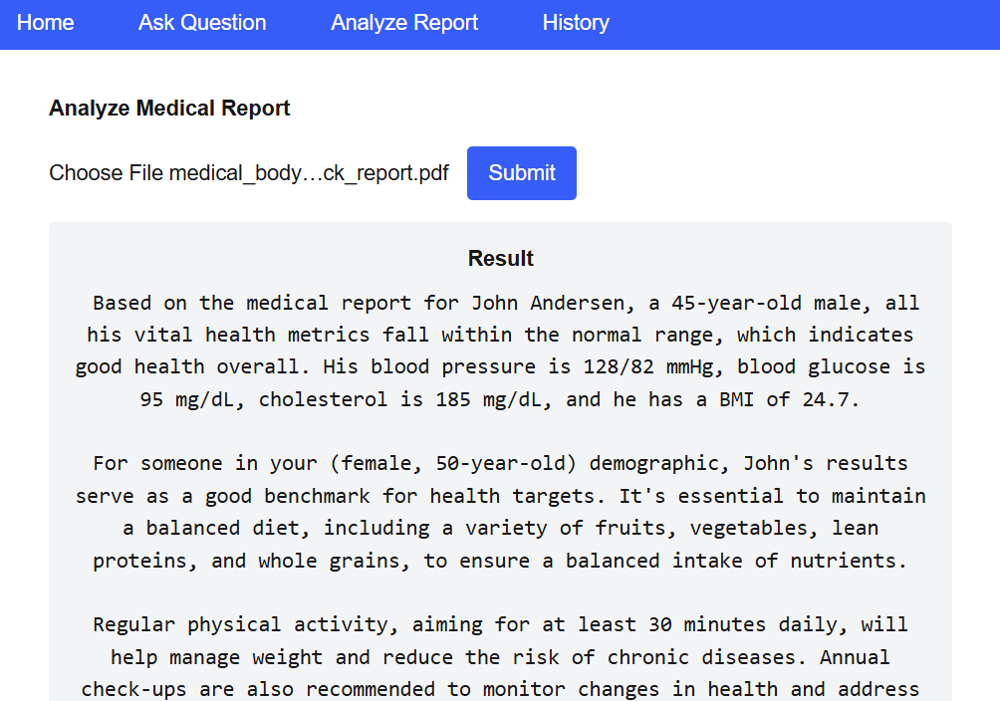

# med-ai-assistant

## Project Description

**med-ai-assistant** is an AI-powered tool designed to analyze medical examination reports and explain them in plain, easy-to-understand language for patients. It supports both Chinese and English. The inspiration for this project comes from the need to help family members understand their medical reports, especially when they are in a foreign language.

---





## Features

- Analyze and interpret medical reports in Chinese and English
- User-friendly explanations for non-medical users
- RAG (Retrieval-Augmented Generation) backend with FAISS and OpenAI
- FastAPI backend with pydantic for data validation
- Next.js frontend with Tailwind CSS for a modern UI
- User information and query history management

---

## Backend

- **Tech Stack:** FastAPI, pydantic, langchain, FAISS, OpenAI, bge-small-en, context engineering
- **Prepare vector DB:**
  ```bash
  cd Document handler
  python chunk_medical_data.py
  ```
- **Setup:**
  ```bash
  cd ..
  pip install -r requirements-dev.txt
  ```
- **Start the server:**
  ```bash
  cd backend
  python -m uvicorn backend.main:app --reload
  ```

---

## Frontend

- **Tech Stack:** Next.js, Tailwind CSS
- **Setup:**
  ```bash
  cd frontend
  npm install
  ```
- **Start the development server:**
  ```bash
  npm run dev
  ```

---

## Usage

1. Save user information (age, gender) on the main page.
2. Ask questions or upload medical reports for analysis.
3. View AI-generated explanations and structured indicator tables.
4. Check your query history at any time.

---

## Inspiration

This project was inspired by the real-life need to help parents and family members understand their medical reports, especially when they are written in English or contain complex medical terminology.

---

## License
